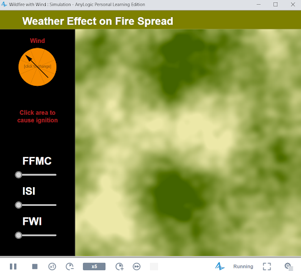
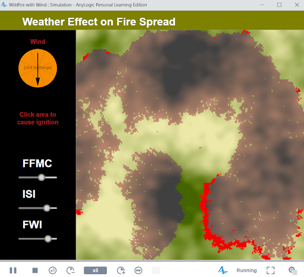

# Effects of Weather Patterns on Forest Fire Spread

This repository contains the AnyLogic model for the project "Effects of Weather Patterns on Forest Fire Spread." This model simulates the influence of weather factors on wildfire dynamics, utilizing the Fire Weather Index (FWI) and the National Burned Area Composite (NBAC) dataset to enhance our understanding of fire behavior under different conditions.

---

## Table of Contents

1. [Prerequisites](#prerequisites)
2. [Cloning the Repository](#cloning-the-repository)
3. [Importing the Model in AnyLogic](#importing-the-model-in-anylogic)
4. [Running the Model](#running-the-model)
5. [Adjusting Parameters](#adjusting-parameters)
6. [Outputs](#outputs)
7. [Acknowledgments](#acknowledgments)

---

## Prerequisites

To open and run this model, you need:
- **AnyLogic Software**: Please install AnyLogic (version X.X or later) from [AnyLogic's official website](https://www.anylogic.com/).
- **Git** (optional): If you prefer cloning via command line.

---

## Cloning the Repository

To obtain a copy of this project, follow one of these methods:

### Method 1: Cloning via Git

If Git is installed, open a terminal and enter the following command:

```bash
git clone https://github.com/yourusername/your-repository-name.git
```
### Downloading the Repository

1. **Download as ZIP**:
   - Go to the repository’s GitHub page.
   - Click on **Code > Download ZIP**.
   
2. **Extract the ZIP**:
   - Unzip the downloaded file to a folder of your choice on your local machine.

---

## Importing the Model in AnyLogic

1. **Open AnyLogic**:
   - Start AnyLogic on your computer.

2. **Import the Project**:
   - In AnyLogic, go to **File > Open Project**.
   - Navigate to the folder where you extracted the ZIP file.
   - Select the `.alp` file (e.g., `ForestFireSpreadModel.alp`) and click **Open**.

---

## Running the Model

1. **Select the Experiment**:
   - Locate the **Projects** pane (usually on the left side of the AnyLogic interface).
   - Select the main experiment, typically named `Main` or `Simulation`.

2. **Run the Experiment**:
   - Click the **Run** button (green triangle) in the AnyLogic toolbar, or right-click the experiment name and select **Run**.

3. **View the Simulation**:
   - The simulation window will open, displaying the wildfire spread based on selected weather conditions.

### Example

Here’s an example screenshot of the simulation:






---

## Adjusting Parameters

You can modify certain weather and fire parameters to see how different conditions affect the simulation:

1. **Locate Parameters**:
   - In the **Projects** pane, click on the main experiment (`Simulation` or `Main`).
   
2. **Modify Values**:
   - Adjust fields like `windSpeed`, `temperature`, and `humidity` to simulate various scenarios.

3. **Save and Run**:
   - After modifying parameters, save changes and **Run** the experiment again to see the effects.

---

## Outputs

The model provides several outputs, including:
- **Fire Spread Rate**: Shows how quickly the fire spreads based on weather and vegetation conditions.
- **Burn Area**: Indicates the total area burned.
- **Weather Impact Analysis**: A breakdown of how factors like wind and humidity influence fire spread dynamics.

---

## Acknowledgments

Special thanks to Dr. Ziad Kobti and Dr. Xianli Wang for their support and guidance.

**Technologies used**:
- **AnyLogic**: For simulation modeling.
- **Java**: For programming and model customization.

